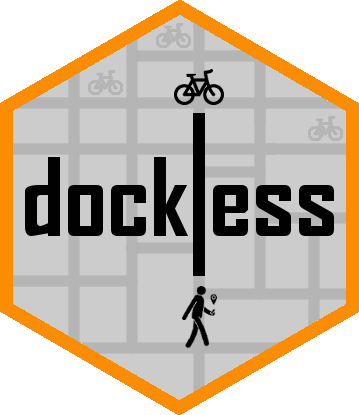

```{r setup, include=FALSE}
knitr::opts_chunk$set(echo = TRUE)
```

# The dockless package 

The dockless package contains the code for my master thesis **Spatiotemporal Forecasts for Bike Availability in Dockless Bike Sharing Systems**. The package can be installed as follows, given that you have `devtools` installed in advance.

```{r, echo = TRUE, eval = FALSE}
devtools::install_github('luukvdmeer/dockless')
```

The analysis can be reproduced with the following code:

```{r, echo = TRUE, eval = FALSE}
require(dockless)
require(sf)

## ----------------------- CLUSTER LOOP --------------------------

# Create grid
gridcells = dockless::create_grid(
  area = systemarea,
  cellsize = c(500, 500)
)

# Calculate grid cell centroids
gridcentroids = gridcells %>%
  dockless::project_sf() %>%
  sf::st_centroid() %>%
  sf::st_transform(crs = 4326)

# Usage intensity per grid cell
gridcells$intensity = dockless::usage_intensity(
  usage = usagedata_train,
  grid = gridcells
)

# Add intensity information to grid cell centroids
gridcentroids$intensity = gridcells$intensity

# Cluster
clusters = dockless::spatial_cluster(
  data = distancedata_centroids,
  grid = gridcells,
  area = systemarea,
  K = c(3:10),
  omega = seq(0, 1, 0.1)
)


# Add cluster information to grid cells and grid cell centroids
gridcells$cluster     = clusters$indices
gridcentroids$cluster = clusters$indices

# Create model points
modelpoints = dockless::create_modelpoints(
  centroids = gridcentroids
)

## ------------------------ MODEL LOOP ---------------------------

# Build models
models = dockless::build_models(
  data = distancedata_modelpoints,
  auto_seasonality = TRUE,
  seasons = list(NULL, 96, 672, c(96, 672))
)

## ---------------------- FORECAST LOOP --------------------------

# Forecast test points with DBAFS and NFS
forecasts_dbafs = dockless::forecast_multiple(
  data = distancedata_testpoints,
  method = 'DBAFS',
  points = testpoints,
  models = models
)

forecasts_nfs = dockless::forecast_multiple(
  data = distancedata_testpoints,
  method = 'NFS',
  points = testpoints
)

# Calculate RMSE's
errors_dbafs = dockless::evaluate(
  forecasts_dbafs,
  type = 'RMSE',
  clusters = testpoints$cluster
)

errors_nfs   = dockless::evaluate(
  forecasts_nfs,
  type = 'RMSE',
  clusters = testpoints$cluster
)
```

Furthermore, reproducible scripts for all tables and figures in chapter 5 can be found through in the [scripts folder](https://github.com/luukvdmeer/dockless/tree/master/scripts)
